<!-- README.md is generated from README.Rmd. Please edit that file -->

## How to apply LineageHomology on a phylogeny with tips observed in two geographical locations.

#### Table of contents

-   [Simulate tip data with two
    locations](#simulate-phylogeographic-data-with-two-locations--norway-and-rest-of-the-world--row-)
-   [Running LineageHomology](#running-lineagehomology)
-   [Treemap plots of transmission
    lineages](#make-a-treemap-plot-to-get-a-quick-overview-of-the-lineages)
-   [Ridgeline plots of transmission
    lineages](#plot-lineage-densities-over-time)
    -   [Color the lineages after
        location](#we-can-color-the-groups-by-the-state-they-are-in--and-restrict-the-plotted-groups-to-sizes-larger-than-1-4--and-10)
-   [Plot cumulative lineage size over
    time.](#plot-cumulative-lineage-size-over-time)
    -   [Color the lineages after
        location](#again-we-can-add-color-to-the-groups-by-specifying-it)
-   [Sample transmission lineages
    probabilistically](#probabilistic-counting-of-transmission-lineages)
-   [Produce confidence interval on the largest transmission
    lineage](#estimate-size-of-largest-transmission-lineage)
-   [Estimate importation and local transmission from phylogeographic
    results](#estimating-importation-and-local-transmission)

``` r
#Load needed packages
library(LineageHomology)
library(ggplot2)
library(scales)
library(lubridate)

#Loading other packages for simulating data. 
library(ape)
library(phytools)
library(phangorn)
library(BactDating)

#Pipe operator
library(dplyr)
```

## Simulate tip data with two different states.

Here we use the R packages BactDating and Phytools to simulate time
dated geographical data on a phylogeny with two locations. We let the
geographical states represent Norway (represented by red colour) and the
rest of the World (RoW) (represented by blue colour).

``` r
set.seed(400)
tree_test = BactDating::simdatedtree(nsam=300, dateroot=2000) #300 taxa and date of the root at year 2000-
tree_test = ladderize(tree_test) #Reorder the tree to make it look nice
Q=matrix(c(0.5,0.5,0.5,0.5), nrow=2,ncol=2, byrow=F) #Set up a transition matrix for trait simulation
colnames(Q)=c("Norway","RoW") #From state 1 to state 2. 
rownames(Q)=c("Norway","RoW") #From state 1 to state 2. 

trait = phytools::sim.Mk(tree=tree_test,Q=Q,nsim=1) #Simulate the traits on the phylogeny

#Reconstruct ancestral states using ace. 
fit1 = ace(x=trait, phy= tree_test, type="discrete", mod="ARD") #Estimate the ancestral history

plot.phylo(tree_test,lwd=2,label.offset = 0.15, mar=c(0.2,0.2,0.2,0.2),cex=0.3) #Ploy phylogeny

axisPhylo(root.time=2000, backward=F) #Add time axis

nodelabels(pie=fit1$lik.anc,cex=0.2,piecol=c("Red","Blue"))
tips = to.matrix(trait,seq=c("Norway", "RoW"))
tiplabels(pie=tips, cex=0.2,piecol=c("Red","Blue"))
```

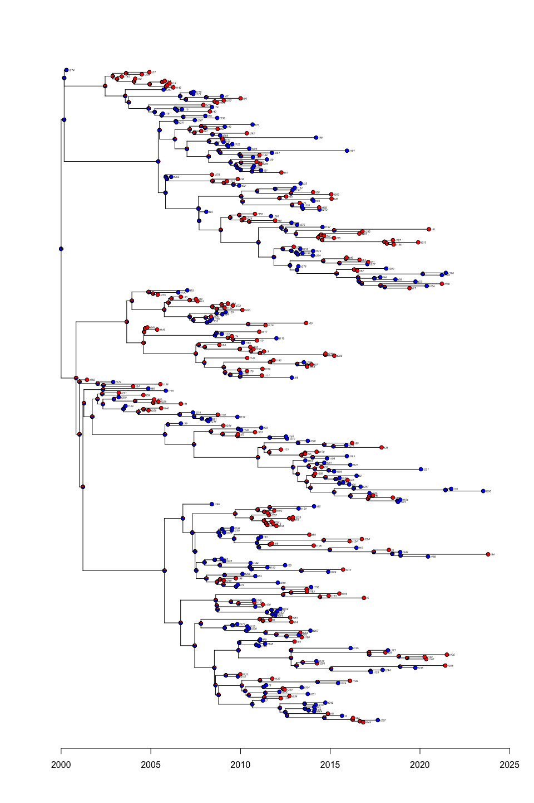

The pie charts on the nodes of the phylogeny represent the probability
of the node being in the different geographical locations, where red
represents Norway, and blue represents RoW. LineageHomology uses these
probabilities to count connected groups of tips, where all the nodes on
the paths between them have a probability that \> 50% for the same
geographical state. LineageHomology also returns the number of tips that
are not connected to any other tips in this way. Following du Plessis et
al. (2021) (DOI: 10.1126/science.abf2946) we refer to the groups as
transmission lineages (TLs) and isolated tips as singletons.

## Running LineageHomology

Next we run LineageHomology. The inputs data should take this format.

``` r
tree_test
#> 
#> Phylogenetic tree with 300 tips and 299 internal nodes.
#> 
#> Tip labels:
#>   t214, t151, t158, t56, t40, t13, ...
#> 
#> Rooted; includes branch lengths.
head(fit1$lik.anc)
#>         Norway       RoW
#> 301 0.19739205 0.8026080
#> 302 0.09659401 0.9034060
#> 303 0.09487369 0.9051263
#> 304 0.69688117 0.3031188
#> 305 0.43888708 0.5611129
#> 306 0.42001122 0.5799888
head( to.matrix(trait, seq=c("Norway", "RoW")))
#>      Norway RoW
#> t214      1   0
#> t151      0   1
#> t158      0   1
#> t56       0   1
#> t40       1   0
#> t13       0   1
```

Note that the node probabilities of the tips must have row names that
match the tips of the phylogeny.

``` r
Result = LineageHomology(tree_test, ace_nodes=fit1$lik.anc,
                        ace_tips = to.matrix(trait, seq=c("Norway", "RoW")), start_time=2000)
```

LineageHomology returns multiple values

-   Import_LocalTrans The first entry can be thought of as an estimate
    of the number of tips that have acquired their state through novel
    acquisition (a transition in the phylogeny). Similarly, the second
    number describes the number of tips that have inherited their state
    by inheritance (homology). Since each transmission lineage started
    is defined by a state transition, each transmission lineage of size
    n is composed of 1 novel acquisition and n-1 homologous
    acquisitions. Singletons are directly translated to novel
    acquisitions.
-   Lineage_sizes contains the number of tips that belong to each TL.
    This means that all the internal nodes will be mapped to the same
    state with a 50 percent or higher probability for the entire TL.
    \*Taxa_names is a list of lists where each sublist contains the
    names of the tips in each transmission lineage. The order is the
    same as the listed order of the Lineage_sizes.
-   Halfedge_over_tmrca is the time point on the middle of the edge that
    is ancestral to each TL’s mrca. This is used in analyses of
    importation and local transmission.
-   Lineage_state contains the state the transmission lineages are
    mapped to.

``` r
names(Result)
#> [1] "Import_LocalTrans"   "Lineage_sizes"       "Taxa_names"         
#> [4] "MRCA's"              "lineage_state"       "Halfedge_over_tmrca"
Result$Import_LocalTrans
#> [1] 120 180
Result$lineage_state
#> Norway    RoW Norway Norway Norway Norway    RoW    RoW Norway    RoW Norway 
#>      1      2      1      1      1      1      2      2      1      2      1 
#>    RoW Norway    RoW    RoW    RoW    RoW Norway Norway Norway Norway Norway 
#>      2      1      2      2      2      2      1      1      1      1      1 
#>    RoW Norway    RoW Norway Norway Norway    RoW Norway Norway Norway Norway 
#>      2      1      2      1      1      1      2      1      1      1      1 
#> Norway    RoW Norway    RoW Norway    RoW    RoW Norway Norway    RoW    RoW 
#>      1      2      1      2      1      2      2      1      1      2      2 
#> Norway    RoW Norway Norway Norway Norway    RoW Norway Norway Norway Norway 
#>      1      2      1      1      1      1      2      1      1      1      1 
#>    RoW    RoW Norway Norway Norway Norway Norway Norway Norway    RoW Norway 
#>      2      2      1      1      1      1      1      1      1      2      1 
#> Norway Norway    RoW Norway    RoW Norway Norway Norway    RoW Norway    RoW 
#>      1      1      2      1      2      1      1      1      2      1      2 
#> Norway    RoW Norway Norway    RoW Norway Norway    RoW    RoW    RoW Norway 
#>      1      2      1      1      2      1      1      2      2      2      1 
#>    RoW    RoW Norway    RoW Norway    RoW Norway    RoW    RoW Norway    RoW 
#>      2      2      1      2      1      2      1      2      2      1      2 
#> Norway Norway    RoW Norway    RoW    RoW    RoW Norway Norway    RoW    RoW 
#>      1      1      2      1      2      2      2      1      1      2      2 
#>    RoW    RoW Norway    RoW Norway    RoW    RoW Norway Norway    RoW 
#>      2      2      1      2      1      2      2      1      1      2
Result$Lineage_sizes
#>   [1]  1  9  1  2  1  8 18  1  3  1  1  1  2  1  5  7  1  3  1  8  2  1  2  1  1
#>  [26]  1  1  2  2  1  2  1  1  1  1  2  1  1  1  1 23  2  1 43  1  3  1  2  2  1
#>  [51]  2  1  2  1  8  1  1  3  1  1  1  1  1  4  1  1  1  2  1  1  1  1  2  1  1
#>  [76]  2  1  4  2  3  2  4  1  1  1  3  2  1  4  2  2  2  1  1  1  1  2  3  2  1
#> [101]  1  2  2  2  2  4  2  1  1  1  1  1  1  1  2  1  1  1  2  1
head(Result$Taxa_names)
#> $`Lineage no: 1`
#> [1] "t214"
#> 
#> $`Lineage no: 2`
#> [1] "t151" "t158" "t56"  "t13"  "t78"  "t67"  "t121" "t179" "t283"
#> 
#> $`Lineage no: 3`
#> [1] "t40"
#> 
#> $`Lineage no: 4`
#> [1] "t173" "t237"
#> 
#> $`Lineage no: 5`
#> [1] "t90"
#> 
#> $`Lineage no: 6`
#> [1] "t298" "t77"  "t142" "t141" "t18"  "t51"  "t12"  "t145"
Result$`MRCA's`
#>   [1] 2007.930 2003.575 2008.290 2008.563 2010.003 2002.453 2000.000 2012.839
#>   [9] 2008.899 2011.696 2015.350 2018.117 2017.801 2020.377 2016.547 2010.997
#>  [17] 2017.068 2014.607 2012.965 2013.090 2012.813 2012.869 2013.422 2014.381
#>  [25] 2014.017 2015.072 2012.170 2008.436 2009.600 2008.405 2010.026 2012.277
#>  [33] 2011.058 2008.982 2014.212 2007.166 2008.433 2010.349 2009.121 2010.671
#>  [41] 2000.831 2002.355 2002.036 2005.762 2015.719 2009.045 2013.681 2008.684
#>  [49] 2014.641 2017.424 2018.459 2023.799 2011.636 2013.835 2009.699 2013.235
#>  [57] 2014.098 2011.071 2013.331 2013.415 2013.012 2014.263 2021.411 2017.157
#>  [65] 2018.212 2009.985 2014.863 2016.249 2017.649 2011.083 2014.290 2016.099
#>  [73] 2011.329 2012.356 2013.407 2009.467 2010.733 2012.375 2002.329 2004.124
#>  [81] 2004.303 2006.608 2008.731 2009.043 2005.787 2012.925 2014.917 2014.136
#>  [89] 2015.214 2018.742 2017.105 2015.514 2013.682 2016.469 2015.963 2015.299
#>  [97] 2014.016 2010.969 2013.198 2017.861 2016.219 2009.868 2008.353 2011.624
#> [105] 2002.336 2007.166 2010.421 2008.355 2006.529 2007.034 2010.135 2012.856
#> [113] 2009.975 2009.423 2013.700 2013.159 2008.576 2011.045 2009.292 2012.001
Result$lineage_state
#> Norway    RoW Norway Norway Norway Norway    RoW    RoW Norway    RoW Norway 
#>      1      2      1      1      1      1      2      2      1      2      1 
#>    RoW Norway    RoW    RoW    RoW    RoW Norway Norway Norway Norway Norway 
#>      2      1      2      2      2      2      1      1      1      1      1 
#>    RoW Norway    RoW Norway Norway Norway    RoW Norway Norway Norway Norway 
#>      2      1      2      1      1      1      2      1      1      1      1 
#> Norway    RoW Norway    RoW Norway    RoW    RoW Norway Norway    RoW    RoW 
#>      1      2      1      2      1      2      2      1      1      2      2 
#> Norway    RoW Norway Norway Norway Norway    RoW Norway Norway Norway Norway 
#>      1      2      1      1      1      1      2      1      1      1      1 
#>    RoW    RoW Norway Norway Norway Norway Norway Norway Norway    RoW Norway 
#>      2      2      1      1      1      1      1      1      1      2      1 
#> Norway Norway    RoW Norway    RoW Norway Norway Norway    RoW Norway    RoW 
#>      1      1      2      1      2      1      1      1      2      1      2 
#> Norway    RoW Norway Norway    RoW Norway Norway    RoW    RoW    RoW Norway 
#>      1      2      1      1      2      1      1      2      2      2      1 
#>    RoW    RoW Norway    RoW Norway    RoW Norway    RoW    RoW Norway    RoW 
#>      2      2      1      2      1      2      1      2      2      1      2 
#> Norway Norway    RoW Norway    RoW    RoW    RoW Norway Norway    RoW    RoW 
#>      1      1      2      1      2      2      2      1      1      2      2 
#>    RoW    RoW Norway    RoW Norway    RoW    RoW Norway Norway    RoW 
#>      2      2      1      2      1      2      2      1      1      2
```

## Make a treemap plot to get a quick overview of the lineages

The simplest method to visualize the results from LineageHomology is to
use a treemap plot. Treemap_lineagehomology uses the treemap package to
visualize transmission lineages as rectangles with areas that reflect
their relative sizes. Additionally, the text on each square gives the
name of group number of the transmission lineage, the estimated time of
the mrca (TMRCA) of the transmission lineage and the number of tips in
the group (S)

``` r
LineageHomology::treemap_lineagehomology(Result)
```

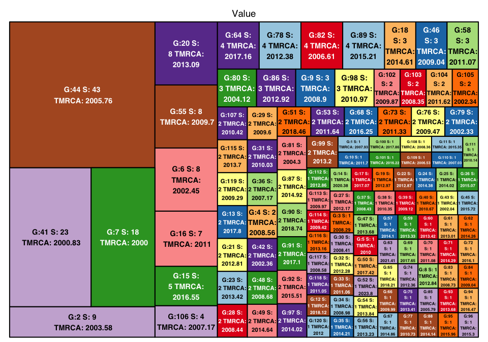

## Plot lineage densities over time

The accumulation of tips in a lineage over time can be visualized by
using density plots. Before using the plotting methods below, we need to
run the processing function lineage_info. lineage_info takes the results
from LineageHomology and names and dates observed dates of the tips in
the tree. The formats of these should match the ones shown below.

``` r
#Set up matrix with taxa info
name_date = data.frame(name = names(trait), dates= BactDating::leafDates(tree_test))
head(name_date)
#>   name    dates
#> 1 t214 2007.930
#> 2 t151 2005.666
#> 3 t158 2008.698
#> 4  t56 2008.041
#> 5  t40 2008.290
#> 6  t13 2006.730
Result_lineage_info = LineageHomology::lineage_info(Result,name_date)
```

Ridgeplot_lineagedensities takes the input from the function
lineage_info and produces density plots using for each TL over time. The
density plots are made using the ggridges R-package. The TLs are sorted
from largest to smallest and can be coloured according to the state that
defines the TL.

``` r
LineageHomology::ridgeplot_lineagedensities(Result_lineage_info=Result_lineage_info,groups_larger_than = 1,datelims=c("2000-01-01","2025-01-01","3 year"),color_by_state = F)
```

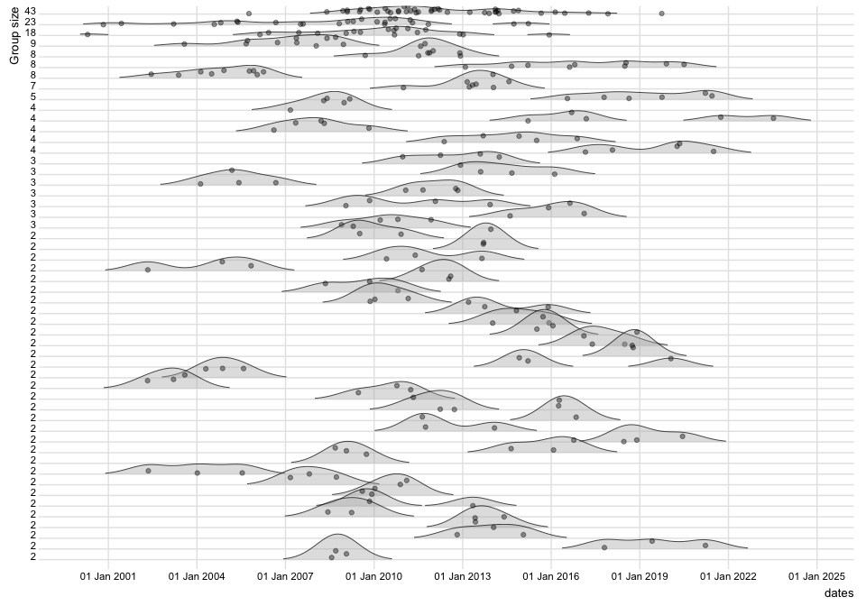

#### We can colour the groups by the state they are in, and restrict the plotted groups to e.g. sizes larger e.g.than 1,4, and 10:

``` r

LineageHomology::ridgeplot_lineagedensities(Result_lineage_info=Result_lineage_info,groups_larger_than = 1,datelims=c("2000-01-01","2025-01-01","3 year"),color_by_state = T)
```

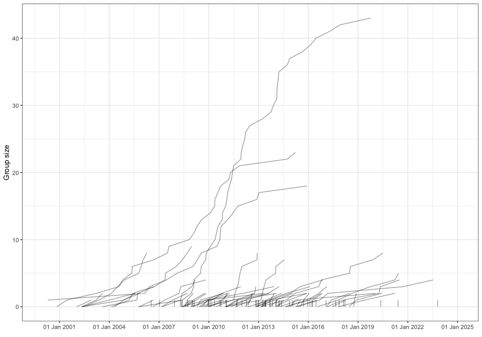

``` r

LineageHomology::ridgeplot_lineagedensities(Result_lineage_info=Result_lineage_info,groups_larger_than = 4,datelims=c("2000-01-01","2025-01-01","3 year"),color_by_state = T)
```

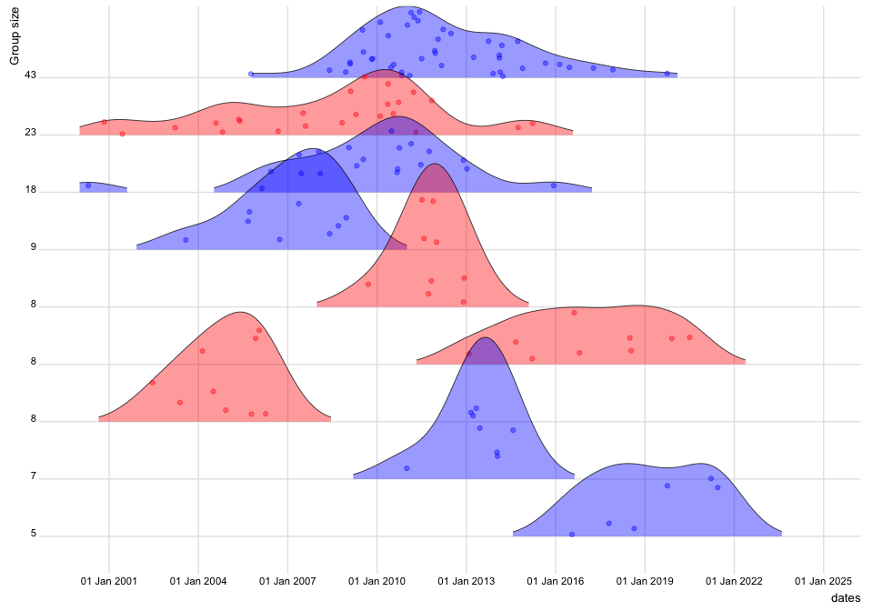

``` r

LineageHomology::ridgeplot_lineagedensities(Result_lineage_info=Result_lineage_info,groups_larger_than = 10,datelims=c("2000-01-01","2025-01-01","3 year"),color_by_state = T)
```

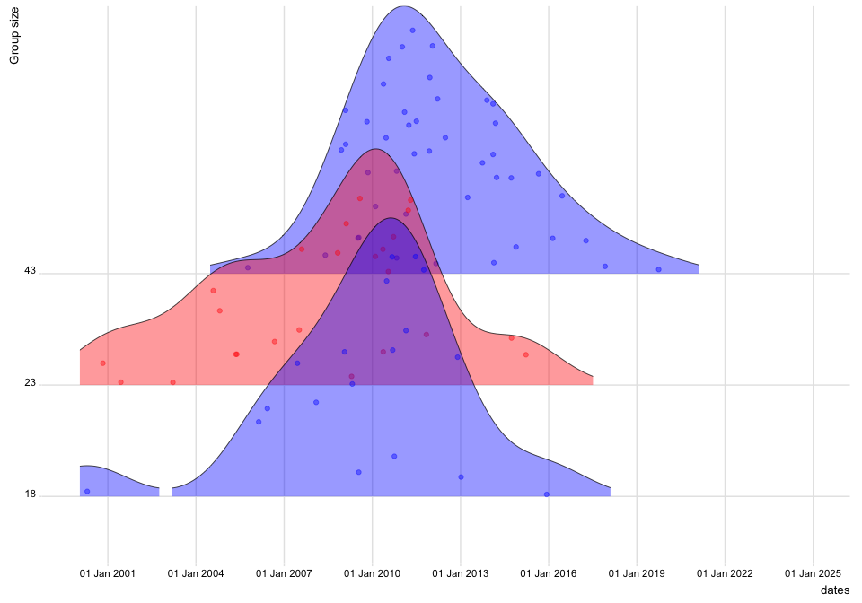

## Plot cumulative lineage size over time.

To visualize growth patterns over time, LineageHomology provides a
function for plotting the cumulative number of observations in each TL
separately.

``` r

LineageHomology::lineage_growth_cumulative(Result_lineage_info = Result_lineage_info, datelims=c("2000-01-01","2025-01-01","3 year"))
```


##### Again, we can add colour to the groups by specifying it.

``` r
LineageHomology::lineage_growth_cumulative(Result_lineage_info = Result_lineage_info, datelims=c("2000-01-01","2025-01-01","3 year"),color_by_state = T)
```

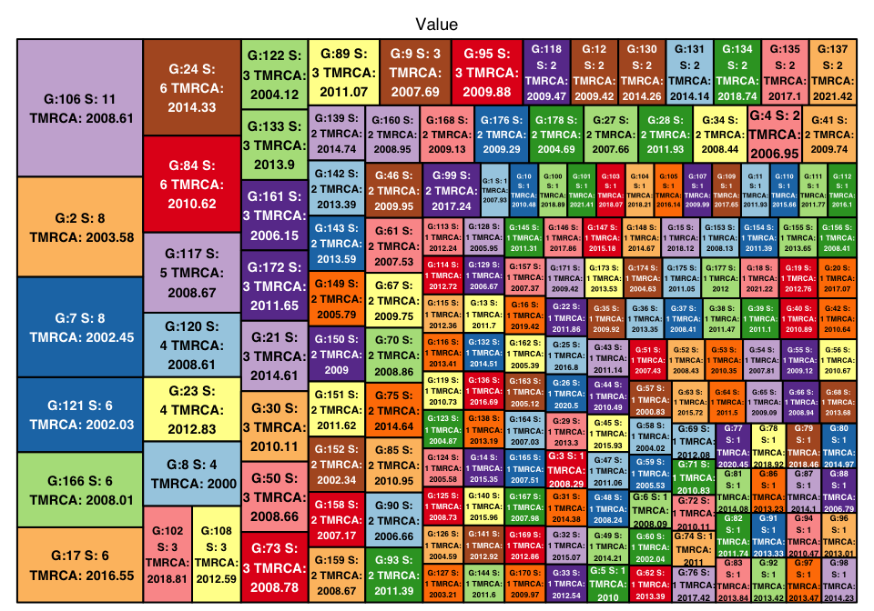

## Probabilistic counting of transmission lineages

In all the figures above, the transmission lineage division was done by
dividing lineages at points where a transition is estimated with more
than 50 percent probability. If one wishes to divide the transmission
lineages by sampling from the observed probabilities, one can use the
function LineageHomology_w\_uncertainty (or v2, which is faster). This
retains the uncertainty in the phylogeographical mapping. Here we
visualize the difference in the assignment of TLs in two runs on the
same mapping by using treemap plots.

``` r
Result1 = LineageHomology_w_uncertainty_v2(tree_test, ace_nodes=fit1$lik.anc,
                        ace_tips = to.matrix(trait, seq=c("Norway", "RoW")), start_time=2000)
LineageHomology::treemap_lineagehomology(Result1)
```

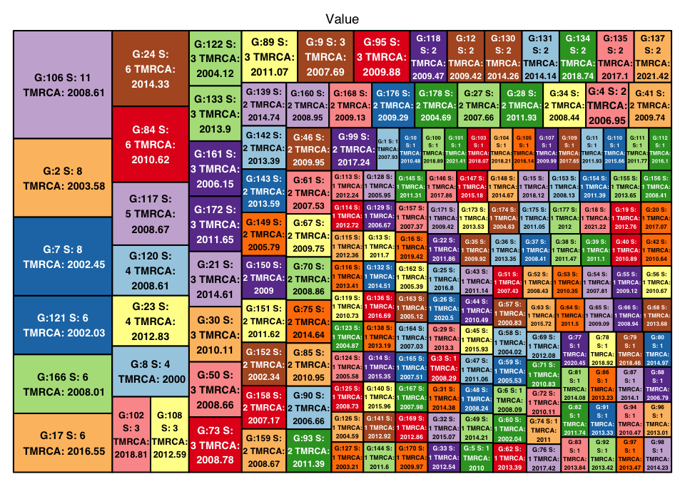

``` r
Result2 =  LineageHomology_w_uncertainty_v2(tree_test, ace_nodes=fit1$lik.anc,
                        ace_tips = to.matrix(trait, seq=c("Norway", "RoW")), start_time=2000)
LineageHomology::treemap_lineagehomology(Result2)
```

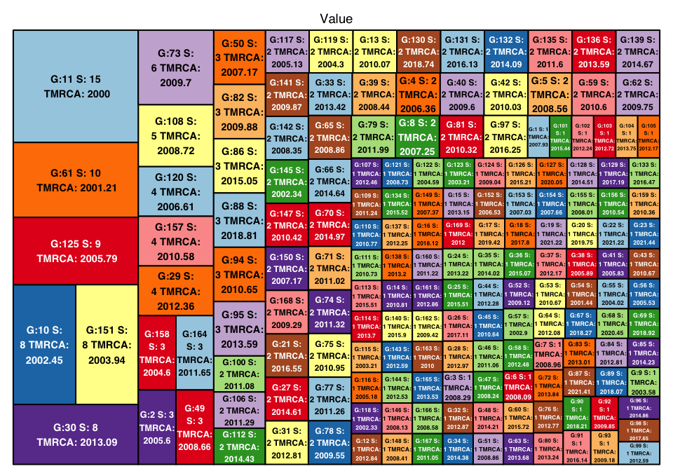

As these figures show, the division of lineages will vary according to
the sampled states of some of the nodes. This can be useful for
producing confidence limits on, e.g. the size of the largest lineage.

## Estimate size of largest transmission lineage

Here we use pbreplicate to counts transmission lineages
probabilistically many times to obtain confidence intervals, or, in this
case, a distribution) for the size of the largest transmission lineage.

``` r
library(pbapply)
multi_counts = pbreplicate(
  1000,
  LineageHomology::LineageHomology_w_uncertainty_v2(
    tree=tree_test,
    ace_nodes=fit1$lik.anc,
    ace_tips = to.matrix(trait, seq=c("Norway", "RoW")),
    start_time = 2000
  )
)

largest_lineage = c()
for(i in 1:1000) {
  largest_lineage = c(largest_lineage, max(multi_counts[,i]$Lineage_sizes))
}

hist(largest_lineage, breaks=100, xlim=c(0,40), probability = F, main="Size of largest transmission lineage",xlab="Size", ylab="Probability")
```

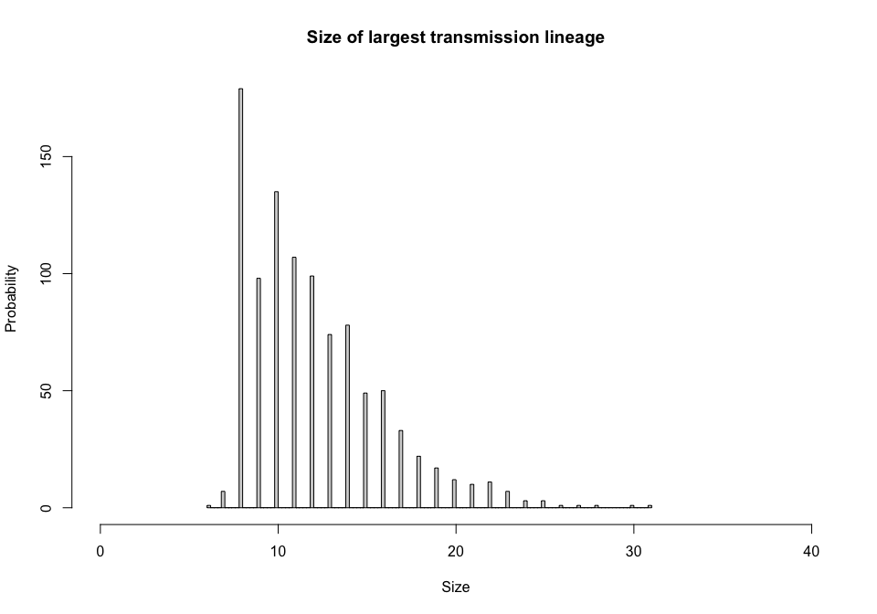

As shown above, in the given mapping, we are confident that the largest
transmission lineage contains no more than 33 tips.

## Estimating importation and local transmission

LineageHomology can also be used to estimate importation and local
transmission over time from the phylogeographic mapping. Here we focus
on Norway and run LineageHomology on the observed tips in Norway before
estimating the contribution of importation and local transmission events
over time in Norway.

``` r
library(pbapply)

Norwegian_tips = names(trait[trait=="Norway"])
head(Norwegian_tips)
#> [1] "t214" "t40"  "t173" "t237" "t90"  "t298"

multi_counts = pbreplicate(
  1000,
  LineageHomology::LineageHomology_w_uncertainty_v2(
    tree=tree_test,
    give_tips = Norwegian_tips,
    ace_nodes=fit1$lik.anc,
    ace_tips = to.matrix(trait, seq=c("Norway", "RoW")),
    start_time = 2000
  )
)


 #Count number of local transmission and importations in half-year (0.5) intervals.
result_import_local_transmission = import_local_transmission(tree = tree_test,LineageHomology_replicates = multi_counts, start_time = 2000,time_interval_size = 0.5)
```

We can summarise the number of tips estimated to be a result of
importation events and local transmission events.

``` r
Summarize_import_local_transmission(LineageHomology_replicates = multi_counts)
#>                          2.5%       50%      97.5%
#> Import             77.9750000 86.000000 94.0000000
#> Local transmission 53.0000000 61.000000 69.0250000
#> Import / Total      0.5304422  0.585034  0.6394558
```

Thus in the phylogeographic mapping above, there seem to be slightly
more importation events in Norway (58%) than local transmission events.
Lastly, we can plot the relative contribution of importation and local
transmission in time intervals spanning half a year.

``` r
plot_importation_local_transmission(tree = tree_test, result_import_local_transmission = result_import_local_transmission,start_time=2000, time_interval_size = 0.5, date_breaks = "2 years",importation_or_local = "both") #Use importation_or_local = "importation" or "local" if you do not have the grid package installed. 
```

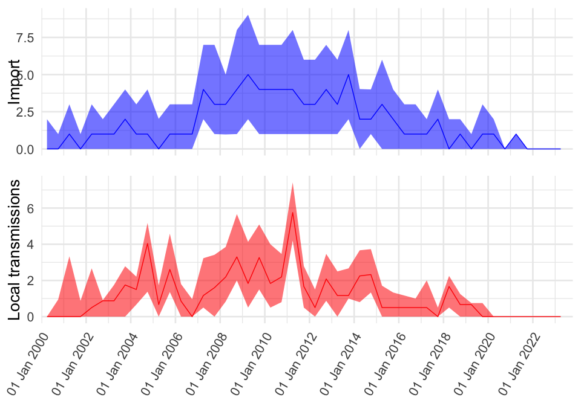

### Questions regarding the package can be directed to <magnusnosnes@gmail.com>
