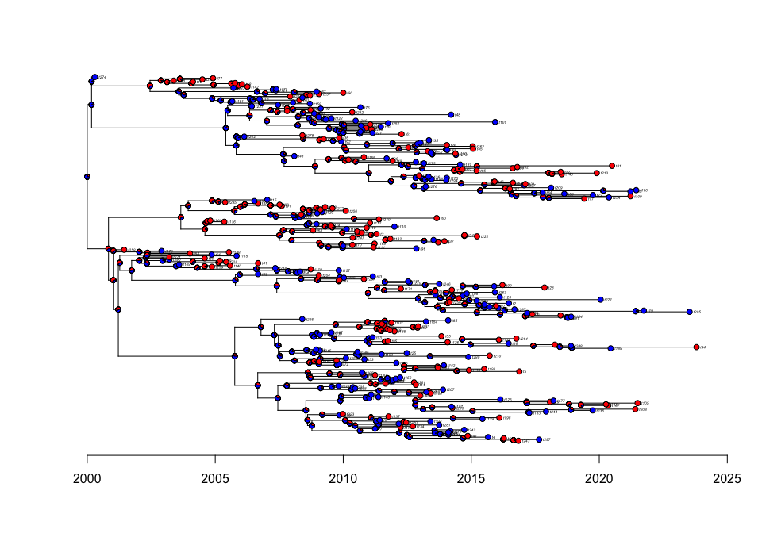

<!-- README.md is generated from README.Rmd. Please edit that file -->

## Example

This is a basic example which shows how used reconstructed ancestral
state histories to estimate local transmission lineages.

``` r
library(LineageHomology)
## basic example code
library(ggplot2)
library(scales)
library(lubridate)
#> 
#> Attaching package: 'lubridate'
#> The following objects are masked from 'package:base':
#> 
#>     date, intersect, setdiff, union
#Loading other packages for simulating data. 
library(ape)
library(phytools)
#> Loading required package: maps
library(phangorn)
library(BactDating)

#Simulate data from Norway and rest of the world
set.seed(400)
tree_test = simdatedtree(nsam=300, dateroot=2000)
tree_test = ladderize(tree_test)
Q=matrix(c(0.5,0.5,0.5,0.5), nrow=2,ncol=2, byrow=F)
colnames(Q)=c("Norway","RoW")
rownames(Q)=c("Norway","RoW")
trait = phytools::sim.Mk(tree=tree_test,Q=Q,nsim=1)

#Reconstruct ancestral states using ace. 
fit1 = ace(x=trait, phy= tree_test, type="discrete", mod="ARD")
plot.phylo(tree_test,lwd=2,label.offset = 0.15, mar=c(0.2,0.2,0.2,0.2),cex=0.3)
axisPhylo(root.time=2000, backward=F)
nodelabels(pie=fit1$lik.anc,cex=0.2,piecol=c("Red","Blue"))
tips = to.matrix(trait,seq=c("Norway", "RoW"))
tiplabels(pie=tips, cex=0.2,piecol=c("Red","Blue"))
```



``` r
Result = LineageHomology(tree_test, ace_nodes=fit1$lik.anc,
                        ace_tips = to.matrix(trait, seq=c("Norway", "RoW")), start_time=2000)
Result$lineage_state
#> Norway    RoW Norway Norway    RoW    RoW Norway Norway Norway    RoW    RoW 
#>      1      2      1      1      2      2      1      1      1      2      2 
#>    RoW Norway Norway Norway Norway    RoW    RoW Norway Norway    RoW Norway 
#>      2      1      1      1      1      2      2      1      1      2      1 
#> Norway Norway    RoW Norway Norway    RoW    RoW    RoW Norway Norway Norway 
#>      1      1      2      1      1      2      2      2      1      1      1 
#>    RoW Norway Norway Norway Norway Norway Norway    RoW Norway Norway Norway 
#>      2      1      1      1      1      1      1      2      1      1      1 
#> Norway    RoW Norway Norway    RoW Norway    RoW    RoW    RoW Norway    RoW 
#>      1      2      1      1      2      1      2      2      2      1      2 
#>    RoW Norway    RoW Norway Norway    RoW    RoW Norway    RoW    RoW Norway 
#>      2      1      2      1      1      2      2      1      2      2      1 
#>    RoW    RoW    RoW Norway    RoW Norway    RoW Norway    RoW    RoW Norway 
#>      2      2      2      1      2      1      2      1      2      2      1
Result$Lineage_sizes 
#>  [1]  1 11  2  8 21  1  4  2  3  5  8  1  3  8  2  1  3  2  1  2  2  2  2  4  2
#> [26] 26  2  1 52  4  2  2  1  3  2 10  3  5  3  1  2  2  2  3  4  2  3  2  5  1
#> [51]  1  3  2  1  4  2  2  2  2  1  1  2  3  4  2  2  2  2  5  2  1  1  1  2  1
#> [76]  2  3

#Set up matrix with taxa info
name_date = data.frame(name = names(trait), dates= BactDating::leafDates(tree_test))
Result_lineage_info = LineageHomology::lineage_info(Result,name_date)
LineageHomology::lineage_growth_cumulative(Result_lineage_info = Result_lineage_info, datelims=c("2000-01-01","2025-01-01","3 year"))
#> Warning: Removed 1 row(s) containing missing values (geom_path).
```


``` r
LineageHomology::lineage_growth_cumulative(Result_lineage_info = Result_lineage_info, datelims=c("2000-01-01","2025-01-01","3 year"),color_by_state = T)
#> Warning: Removed 1 row(s) containing missing values (geom_path).
```


