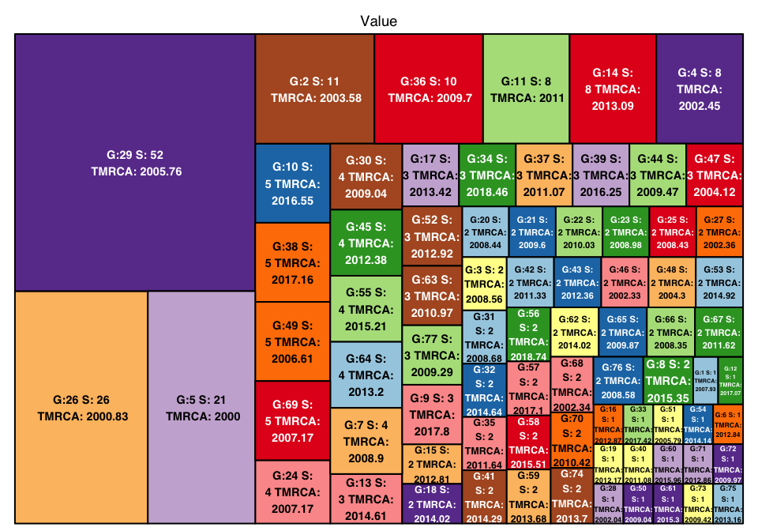
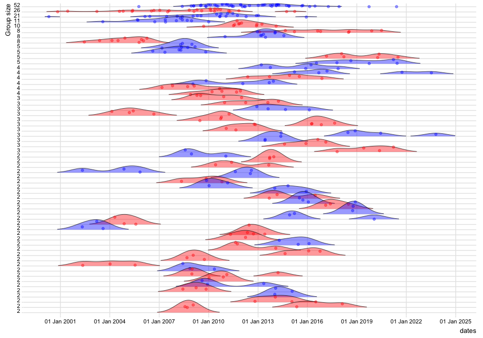
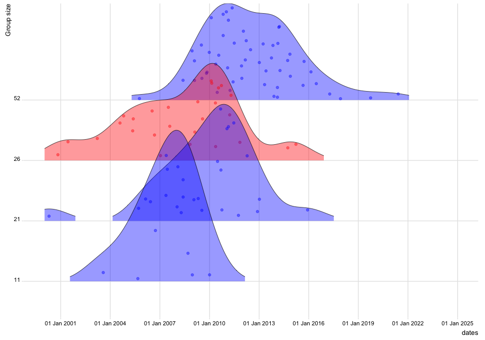

<!-- README.md is generated from README.Rmd. Please edit that file -->

## Using LineageHomology for a given phylogeny and with tips observed in geographical locations.

#### Table of contents

-   [Estimating local transmission linages for phylogeographic data with
    two
    categories.](#estimating-local-transmission-linages-for-phylogeographic-data-with-two-categories)
-   [Simulate tip data with two
    locations](#simulate-phylogeographic-data-with-two-locations--norway-and-rest-of-the-world--row-)
-   [Plotting transmission lineages](#plot-lineage-densities-over-time)
    -   [Color the lineages after
        location](#we-can-color-the-groups-by-the-state-they-are-in--and-restrict-the-plotted-groups-to-sizes-larger-than-1-4--and-10)
-   [Plot cumulative lineage size over
    time.](#plot-cumulative-lineage-size-over-time)
    -   [Again we can add color to the groups by specifying
        it.](#again-we-can-add-color-to-the-groups-by-specifying-it)

``` r
#Load needed packages
library(LineageHomology)
library(ggplot2)
library(scales)
library(lubridate)

#Loading other packages for simulating data. 
library(ape)
library(phytools)
library(phangorn)
library(BactDating)
```

##### Simulate tip data with two different state.

For the purpose of this example we let the geographical states represent
Norway and the rest of the World (RoW). The package was originally
developed for data such as this.

``` r
set.seed(400)
tree_test = simdatedtree(nsam=300, dateroot=2000) #300 taxa and date of the root at year 2000-
tree_test = ladderize(tree_test) #Reorder the tree to make it look nice
Q=matrix(c(0.5,0.5,0.5,0.5), nrow=2,ncol=2, byrow=F) #Set up a transition matrix for trait simulation
colnames(Q)=c("Norway","RoW") #From state 1 to state 2. 
rownames(Q)=c("Norway","RoW") #From state 1 to state 2. 

trait = phytools::sim.Mk(tree=tree_test,Q=Q,nsim=1) #Simulate the traits on the phylogeny

#Reconstruct ancestral states using ace. 
fit1 = ace(x=trait, phy= tree_test, type="discrete", mod="ARD") #Estimate the ancestral history

plot.phylo(tree_test,lwd=2,label.offset = 0.15, mar=c(0.2,0.2,0.2,0.2),cex=0.3) #Ploy phylogeny

axisPhylo(root.time=2000, backward=F) #Add time axis

nodelabels(pie=fit1$lik.anc,cex=0.2,piecol=c("Red","Blue"))
tips = to.matrix(trait,seq=c("Norway", "RoW"))
tiplabels(pie=tips, cex=0.2,piecol=c("Red","Blue"))
```


The nodes on the phylogeny are piecharts that represents the probability
of either geographical state, where red represents Norway and blue
represents RoW. LineageHomology uses the probabilities to count
connected groups of taxa, where all the nodes on the paths between them
have a probability that &gt; 50% for the same geographical state. It
also returns the number of singletons, dates and has a number of
different plotting methods to display the results.

``` r
Result = LineageHomology(tree_test, ace_nodes=fit1$lik.anc,
                        ace_tips = to.matrix(trait, seq=c("Norway", "RoW")), start_time=2000)
```

LineageHomology outputs a list of lists.

-   Import\_LocalTrans contains an estimate of the number of taxa that
    are have changed state wrt. the state of the closest common
    ancestral node shared with any other taxa.
-   Lineage\_sizes contains the number of taxa that belong to the mapped
    state. This means that for the entire group, all the interal nodes
    will be mapped to the same state with 50% or higher probability.
    \*Taxa names contains sub lists for each lineage, in the same order
    as the other lists.
    -   Each sub list contains the taxa names of all the taxa in the
        group.
-   MRCA’s contains the time of the most recent common ancestor of the
    groups.
-   Lineage\_state contains the state the groups are mapped to, the
    states are treated as numbers in the anlyses, so the relative
    ordering has to be looked up.

``` r
names(Result)
#> [1] "Import_LocalTrans" "Lineage_sizes"     "Taxa_names"       
#> [4] "MRCA's"            "lineage_state"
Result$Import_LocalTrans
#> [1]  77 223
Result$lineage_state
#> Norway    RoW Norway Norway    RoW    RoW Norway Norway Norway    RoW    RoW 
#>      1      2      1      1      2      2      1      1      1      2      2 
#>    RoW Norway Norway Norway Norway    RoW    RoW Norway Norway    RoW Norway 
#>      2      1      1      1      1      2      2      1      1      2      1 
#> Norway Norway    RoW Norway Norway    RoW    RoW    RoW Norway Norway Norway 
#>      1      1      2      1      1      2      2      2      1      1      1 
#>    RoW Norway Norway Norway Norway Norway Norway    RoW Norway Norway Norway 
#>      2      1      1      1      1      1      1      2      1      1      1 
#> Norway    RoW Norway Norway    RoW Norway    RoW    RoW    RoW Norway    RoW 
#>      1      2      1      1      2      1      2      2      2      1      2 
#>    RoW Norway    RoW Norway Norway    RoW    RoW Norway    RoW    RoW Norway 
#>      2      1      2      1      1      2      2      1      2      2      1 
#>    RoW    RoW    RoW Norway    RoW Norway    RoW Norway    RoW    RoW Norway 
#>      2      2      2      1      2      1      2      1      2      2      1
Result$Lineage_sizes
#>  [1]  1 11  2  8 21  1  4  2  3  5  8  1  3  8  2  1  3  2  1  2  2  2  2  4  2
#> [26] 26  2  1 52  4  2  2  1  3  2 10  3  5  3  1  2  2  2  3  4  2  3  2  5  1
#> [51]  1  3  2  1  4  2  2  2  2  1  1  2  3  4  2  2  2  2  5  2  1  1  1  2  1
#> [76]  2  3
head(Result$Taxa_names)
#> $`Lineage no: 1`
#> [1] "t214"
#> 
#> $`Lineage no: 2`
#>  [1] "t151" "t158" "t56"  "t40"  "t13"  "t78"  "t90"  "t67"  "t121" "t179"
#> [11] "t283"
#> 
#> $`Lineage no: 3`
#> [1] "t173" "t237"
#> 
#> $`Lineage no: 4`
#> [1] "t298" "t77"  "t142" "t141" "t18"  "t51"  "t12"  "t145"
#> 
#> $`Lineage no: 5`
#>  [1] "t274" "t43"  "t191" "t132" "t202" "t278" "t30"  "t112" "t106" "t61" 
#> [11] "t21"  "t286" "t101" "t251" "t186" "t184" "t32"  "t11"  "t122" "t231"
#> [21] "t247"
#> 
#> $`Lineage no: 6`
#> [1] "t168"
Result$`MRCA's`
#>  [1] 2007.930 2003.575 2008.563 2002.453 2000.000 2012.839 2008.899 2015.350
#>  [9] 2017.801 2016.547 2010.997 2017.068 2014.607 2013.090 2012.813 2012.869
#> [17] 2013.422 2014.017 2012.170 2008.436 2009.600 2010.026 2008.982 2007.166
#> [25] 2008.433 2000.831 2002.355 2002.036 2005.762 2009.045 2008.684 2014.641
#> [33] 2017.424 2018.459 2011.636 2009.699 2011.071 2017.157 2016.249 2011.083
#> [41] 2014.290 2011.329 2012.356 2009.467 2012.375 2002.329 2004.124 2004.303
#> [49] 2006.608 2009.043 2005.787 2012.925 2014.917 2014.136 2015.214 2018.742
#> [57] 2017.105 2015.514 2013.682 2015.963 2015.299 2014.016 2010.969 2013.198
#> [65] 2009.868 2008.353 2011.624 2002.336 2007.166 2010.421 2012.856 2009.975
#> [73] 2009.423 2013.700 2013.159 2008.576 2009.292
Result$lineage_state
#> Norway    RoW Norway Norway    RoW    RoW Norway Norway Norway    RoW    RoW 
#>      1      2      1      1      2      2      1      1      1      2      2 
#>    RoW Norway Norway Norway Norway    RoW    RoW Norway Norway    RoW Norway 
#>      2      1      1      1      1      2      2      1      1      2      1 
#> Norway Norway    RoW Norway Norway    RoW    RoW    RoW Norway Norway Norway 
#>      1      1      2      1      1      2      2      2      1      1      1 
#>    RoW Norway Norway Norway Norway Norway Norway    RoW Norway Norway Norway 
#>      2      1      1      1      1      1      1      2      1      1      1 
#> Norway    RoW Norway Norway    RoW Norway    RoW    RoW    RoW Norway    RoW 
#>      1      2      1      1      2      1      2      2      2      1      2 
#>    RoW Norway    RoW Norway Norway    RoW    RoW Norway    RoW    RoW Norway 
#>      2      1      2      1      1      2      2      1      2      2      1 
#>    RoW    RoW    RoW Norway    RoW Norway    RoW Norway    RoW    RoW Norway 
#>      2      2      2      1      2      1      2      1      2      2      1
```

\#Make a treemap plot to get a quick overview of the lineages.

``` r
LineageHomology::treemap_lineagehomology(Result)
```



##### Plot lineage densities over time

``` r
#Set up matrix with taxa info
name_date = data.frame(name = names(trait), dates= BactDating::leafDates(tree_test))
Result_lineage_info = LineageHomology::lineage_info(Result,name_date)
LineageHomology::ridgeplot_lineagedensities(Result_lineage_info=Result_lineage_info,groups_larger_than = 1,datelims=c("2000-01-01","2025-01-01","3 year"),color_by_state = F)
```


##### We can color the groups by the state they are in, and restrict the plotted groups to sizes larger than 1,4, and 10

``` r
LineageHomology::ridgeplot_lineagedensities(Result_lineage_info=Result_lineage_info,groups_larger_than = 1,datelims=c("2000-01-01","2025-01-01","3 year"),color_by_state = T)
```



``` r
LineageHomology::ridgeplot_lineagedensities(Result_lineage_info=Result_lineage_info,groups_larger_than = 4,datelims=c("2000-01-01","2025-01-01","3 year"),color_by_state = T)
```


``` r
LineageHomology::ridgeplot_lineagedensities(Result_lineage_info=Result_lineage_info,groups_larger_than = 10,datelims=c("2000-01-01","2025-01-01","3 year"),color_by_state = T)
```



##### Plot cumulative lineage size over time.

``` r
LineageHomology::lineage_growth_cumulative(Result_lineage_info = Result_lineage_info, datelims=c("2000-01-01","2025-01-01","3 year"))
```


##### Again we can add color to the groups by specifying it.

``` r
LineageHomology::lineage_growth_cumulative(Result_lineage_info = Result_lineage_info, datelims=c("2000-01-01","2025-01-01","3 year"),color_by_state = T)
```


