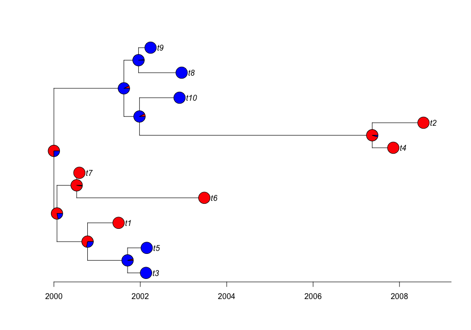

<!-- README.md is generated from README.Rmd. Please edit that file -->

# LineageHomology

-   [Installation](#installation)
-   [Example](#example)
-   [More advanced example and illustrations of some of the plotting
    methods](#for-a-more-advanced-example-and-illustrations-of-some-of-the-plotting-methods-see)

<!-- badges: start -->
<!-- badges: end -->

LineageHomology provides a set of functions that analyzes the outputs
from an ancestral state reconstruction. Following du Plessis et
al. (2021). ( 10.1126/science.abf2946 )to estimate if taxa have
inhereted traits by homology or if their character state represents a
novelty wrt. the other taxa in the tree

## Installation

You can install the latest version of LineageHomology this repository
using

``` r
library(devtools)
devtools::install_github("magnusnosnes/LineageHomology")
```

## Example

This example shows how an reconstructed ancestral state history can be
used to estimate local transmission lineages.

``` r
library(LineageHomology)
## basic example code

#Loading other packages for simulating data. 
library(ape)
library(phytools)
#> Loading required package: maps
library(phangorn)
library(BactDating)

#Simulate data from Norway and rest of the world
set.seed(400)
tree_test = simdatedtree(nsam=10, dateroot=2000)
tree_test = ladderize(tree_test)
Q=matrix(c(0.5,0.5,0.5,0.5), nrow=2,ncol=2, byrow=F)
colnames(Q)=c("Norway","RoW")
loc = c("Norway", "Norway","Norway","RoW", "RoW", "Norway", "Norway", "RoW", "RoW", "RoW")
names(loc) = tree_test$tip.label

#Reconstruct ancestral states using ace. 
fit1 = ace(x=loc, phy= tree_test, type="discrete", mod="ARD")
plot.phylo(tree_test,lwd=2,label.offset = 0.15, mar=c(0.2,0.2,0.2,0.2))
axisPhylo(root.time=2000, backward=F)
nodelabels(pie=fit1$lik.anc,cex=0.7,piecol=c("Red","Blue"))
tips = to.matrix(loc,seq=c("Norway", "RoW"))
tiplabels(pie=tips, cex=0.7,piecol=c("Red","Blue"))
```



``` r
LineageHomology(tree_test, ace_nodes=fit1$lik.anc,
                        ace_tips = to.matrix(loc, seq=c("Norway", "RoW")), start_time=2000)
#> $Import_LocalTrans
#> [1] 4 6
#> 
#> $Lineage_sizes
#> [1] 3 2 2 3
#> 
#> $Taxa_names
#> $Taxa_names$`Lineage no: 1`
#> [1] "t6" "t7" "t1"
#> 
#> $Taxa_names$`Lineage no: 2`
#> [1] "t3" "t5"
#> 
#> $Taxa_names$`Lineage no: 3`
#> [1] "t4" "t2"
#> 
#> $Taxa_names$`Lineage no: 4`
#> [1] "t10" "t8"  "t9" 
#> 
#> 
#> $`MRCA's`
#> [1] 2000.000 2001.705 2007.369 2001.620
#> 
#> $lineage_state
#> Norway    RoW Norway    RoW 
#>      1      2      1      2
```

#### For a more advanced example and illustrations of some of the plotting methods see

[Plotting tutorial
link](https://github.com/magnusnosnes/LineageHomology/blob/master/Examples_and_plotting_methods/Simple_example/Basic_plotting.md)
