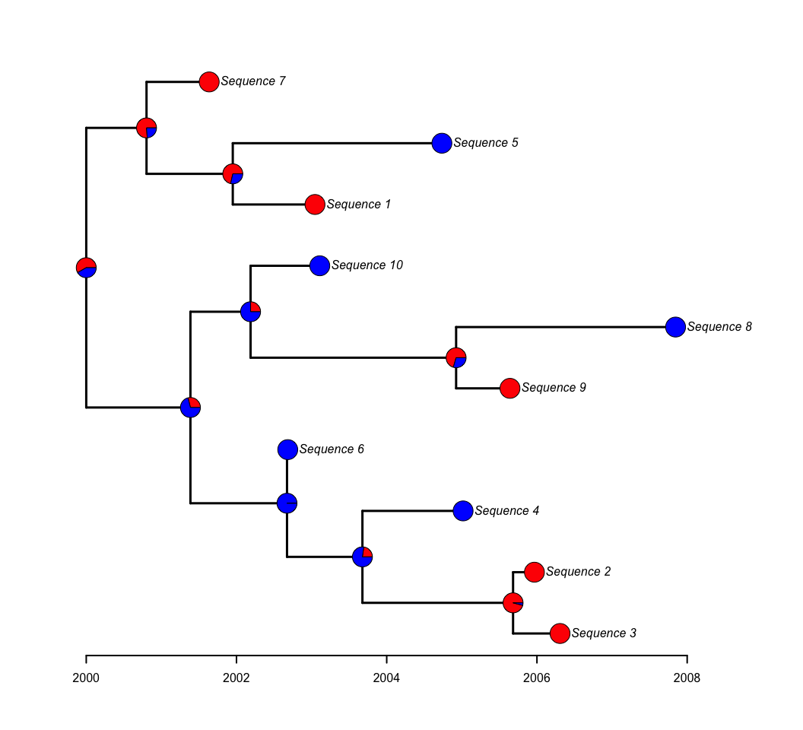
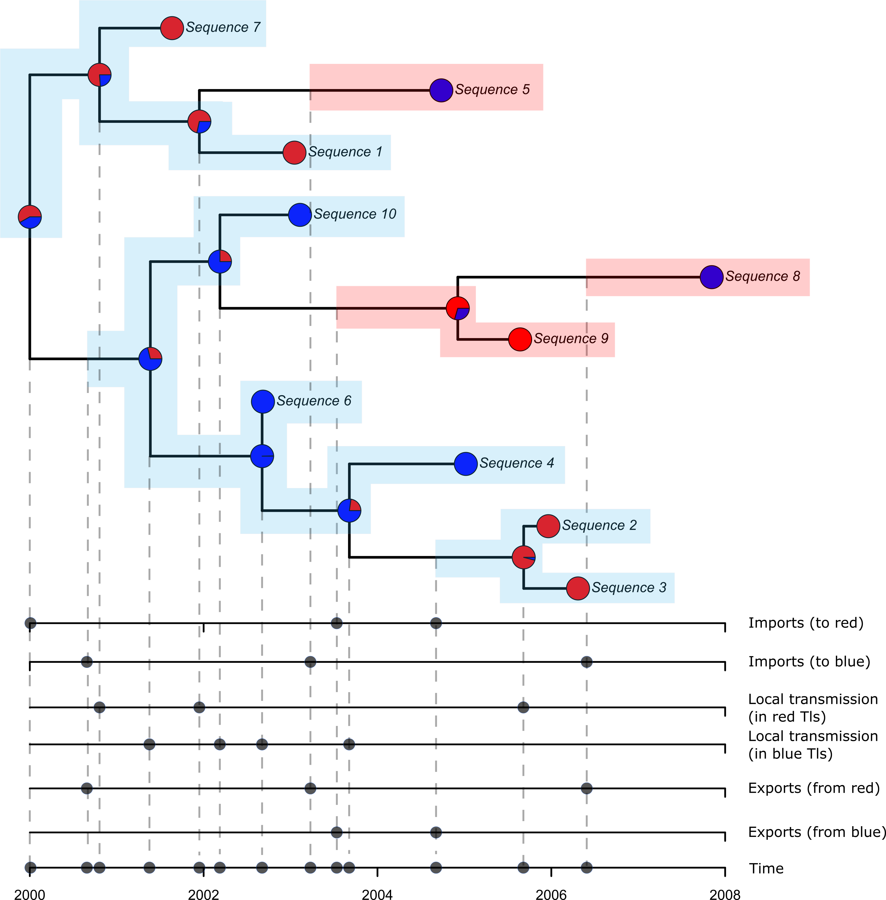
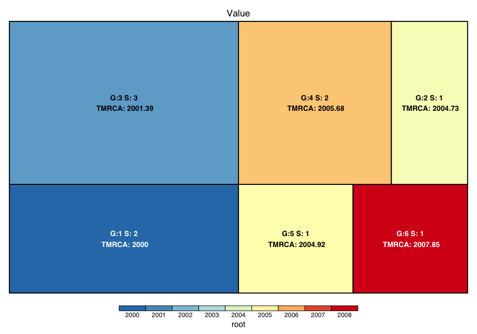
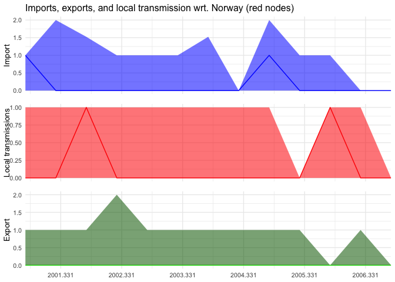

# LineageHomology

- [Installation](#installation)
- [Introduction](#introduction)
- [Function reference](#function-reference)
- [Tutorial and gallery of plotting methods](#tutorial)

LineageHomology is an R-package that offers a set of functions for
analyzing the outputs of ancestral state reconstructions. The package
defines transmission lineages (TLs) and singletons based on state
probabilities at each node in the reconstruction. TLs are defined as
connected groups of tips where state transitions between ancestral and
descendant nodes have a probability lower than 50 percent, while
singletons are tips not connected to any other tips in this way. The
method used in LineageHomology is similar to that introduced by [du
Plessis et
al. (2021)](https://www.science.org/doi/10.1126/science.abf2946) (DOI:
10.1126/science.abf2946). The package also provides functions to
calculate the sizes of TLs, the number of singletons, estimates of
importation and local transmission, and other useful summaries, as well
as various plotting functions to visualize the results.

## Installation

You can install the latest version of LineageHomology by using devtools:

``` r
library(devtools)
devtools::install_github("magnusnosnes/LineageHomology")
```

## Introduction

This introduction provides a simple demonstration of how to apply
LineageHomology to analyze outputs of an ancestral state reconstruction
of simulated geographical data for two locations. We use LineageHomology
to describe transmission lineages and plot the sizes and estimated time
of the most recent common ancestor for each TL.

First, we simulate data and estimate the ancestral geographical states:

``` r
library(LineageHomology)
#Loading required packages.
library(ape)
#Loading other packages for simulating data. 
library(BactDating)
#Date formatting
library(lubridate)


#Simulate data from Norway and rest of the world
tree_test = simdatedtree(nsam=10, dateroot=2000)
tree_test = ladderize(tree_test)
```

``` r
tiplabels=c("Sequence 7","Sequence 1","Sequence 5","Sequence 6","Sequence 4",
            "Sequence 3","Sequence 2","Sequence 9","Sequence 8","Sequence 10")
tree_test$tip.label=tiplabels
loc = c("Norway", "Norway","RoW","RoW", "RoW",
        "Norway", "Norway", "Norway", "RoW", "RoW")
names(loc) = tree_test$tip.label

#Reconstruct ancestral states using ace. 
fit1 = ace(x=loc, phy= tree_test, type="discrete", mod="ARD")
plot.phylo(tree_test,edge.width = 3,label.offset = 0.15, mar=c(0.2,0.2,0.2,0.2))
axisPhylo(root.time=2000, backward=F,lwd=2)
nodelabels(pie=fit1$lik.anc,cex=0.7,piecol=c("Red","Blue"))
tips = to.matrix(loc,seq=c("Norway", "RoW"))
tiplabels(pie=tips, cex=0.7,piecol=c("Red","Blue"))
```



**Figure 1:** The tree shows the reconstructed states using the ace
function in the ape package. Each node is coloured according as a
piechart with the probability of the location (red vs blue). For this
example red represents Norway, and blue represents the rest of the world
(RoW).



**Figure 2:** This figure shows how LineageHomology estimates
transmission lineages, singletons, importation, exportation and local
transmission events. The green-shaded background represents transmission
lineages and encompasses the tips that are included in the group. The
transmission lineages are defined based on a 50 percent probability of
the same state on every node within the TL. The pink-shaded background
denotes singletons, which are unconnected to any other tips as per the
rule that defines TLs. The areas showing TLs and singletons extend back
to the importation date, which is the midpoint of the edge ancestral to
the most recent common ancestor (MRCA) for the TLs and the midpoint on
the ancestral edge leading to the first geographical transitions for
singletons. Exports are set to the estimated time at the midpoint of the
branch that leads to a different geographical location. Branching events
within TLs are used as estimates of local transmission. All types of
events are projected down as black points to individual axes to show the
events with respect to the focal location (red or blue / Norway or RoW).

Next we run LineageHomology on the output from ace according to the
approach outlined above.

``` r
Return = LineageHomology(tree_test, ace_nodes=fit1$lik.anc,
                        ace_tips = to.matrix(loc, seq=c("Norway", "RoW")), start_time=2000)
Return
#> $Import_LocalTrans
#> [1] 6 4
#> 
#> $Lineage_sizes
#> [1] 2 1 3 2 1 1
#> 
#> $Taxa_names
#> $Taxa_names$`Lineage no: 1`
#> [1] "Sequence 7" "Sequence 1"
#> 
#> $Taxa_names$`Lineage no: 2`
#> [1] "Sequence 5"
#> 
#> $Taxa_names$`Lineage no: 3`
#> [1] "Sequence 6"  "Sequence 4"  "Sequence 10"
#> 
#> $Taxa_names$`Lineage no: 4`
#> [1] "Sequence 3" "Sequence 2"
#> 
#> $Taxa_names$`Lineage no: 5`
#> [1] "Sequence 9"
#> 
#> $Taxa_names$`Lineage no: 6`
#> [1] "Sequence 8"
#> 
#> 
#> $`MRCA's`
#> [1] 2000.000 2004.735 2001.387 2005.682 2004.924 2007.846
#> 
#> $lineage_state
#> Norway    RoW    RoW Norway Norway    RoW 
#>      1      2      2      1      1      2 
#> 
#> $Halfedge_over_tmrca
#> [1] 2000.000 2003.343 2000.693 2004.679 2003.556 2006.385
```

In this example LineageHomology returned four 3 transmission lineages.
The taxa names of the tips included in each lineage is printed above
under “\$Taxa_names”. Lineages that only contain one tip are singletons.

The size distributions can be visualised by, e.g. using a treemap plot:

``` r
LineageHomology::treemap_TLs(Return)
```



**Figure 3:** The figure shows squares with areas representing the
transmission lineages’ sizes. The text on the squares gives the
estimated time of the MRCA and the number of tips in the transmission
lineages.

To obtain estimates of import, export and local transmission we first
redo transmission lineage assignment based on the uncertainty of the
geographical states of the nodes. Then we counts import, export and
local transmission events in time intervals of sizes specified by using
the time_interval_size argument.

``` r

# Redo transmission lineage assignment based on the observed probability of the geographical state of each node in the phylogeny. 
multi_counts = replicate(
  100,
  LineageHomology::LineageHomology_w_uncertainty_v2(
    tree=tree_test,
    ace_nodes=fit1$lik.anc,
    ace_tips = to.matrix(loc, seq=c("Norway", "RoW")),
    start_time = 2000)
  )

# Calculate estimates of import, export, and local transmissions
import_export_local_transmission_counts = import_export_local_transmission(
  tree_test,LineageHomology_replicates = multi_counts,
  start_time=2000,
  time_interval_size=0.5,
  focal_location = "Norway")
#> 1 % 2 % 3 % 4 % 5 % 6 % 7 % 8 % 9 % 10 % 11 % 12 % 13 % 14 % 15 % 16 % 17 % 18 % 19 % 20 % 21 % 22 % 23 % 24 % 25 % 26 % 27 % 28 % 29 % 30 % 31 % 32 % 33 % 34 % 35 % 36 % 37 % 38 % 39 % 40 % 41 % 42 % 43 % 44 % 45 % 46 % 47 % 48 % 49 % 50 % 51 % 52 % 53 % 54 % 55 % 56 % 57 % 58 % 59 % 60 % 61 % 62 % 63 % 64 % 65 % 66 % 67 % 68 % 69 % 70 % 71 % 72 % 73 % 74 % 75 % 76 % 77 % 78 % 79 % 80 % 81 % 82 % 83 % 84 % 85 % 86 % 87 % 88 % 89 % 90 % 91 % 92 % 93 % 94 % 95 % 96 % 97 % 98 % 99 % 100 % 1 % 2 % 3 % 4 % 5 % 6 % 7 % 8 % 9 % 10 % 11 % 12 % 13 % 14 % 15 % 16 % 17 % 18 % 19 % 20 % 21 % 22 % 23 % 24 % 25 % 26 % 27 % 28 % 29 % 30 % 31 % 32 % 33 % 34 % 35 % 36 % 37 % 38 % 39 % 40 % 41 % 42 % 43 % 44 % 45 % 46 % 47 % 48 % 49 % 50 % 51 % 52 % 53 % 54 % 55 % 56 % 57 % 58 % 59 % 60 % 61 % 62 % 63 % 64 % 65 % 66 % 67 % 68 % 69 % 70 % 71 % 72 % 73 % 74 % 75 % 76 % 77 % 78 % 79 % 80 % 81 % 82 % 83 % 84 % 85 % 86 % 87 % 88 % 89 % 90 % 91 % 92 % 93 % 94 % 95 % 96 % 97 % 98 % 99 % 100 %

# plot results with TL assignment uncertainty. 
plot_import_export_local_transmission(
  result_import_export_local_transmission = import_export_local_transmission_counts,
  time_interval_size = 0.5,
  start_time=2000,
  date_breaks = 1, 
  main_title = "Imports, exports, and local transmission wrt. Norway (red nodes)", 
  time_interval=c("2000-05-01", "2007-01-01") ,
  tree = tree_test, 
  text_size = 10)
```



**Figure 4:** The figure shows the estimates of imports, exports and
local transmission with respect to Norway. The estimates were obtained
by running LineageHomology_w\_uncertainty_v2 100 times to repeat
transmission lineage assignments from the geographical state
probabilites.

## Function reference

| Functions for analysis                | Description                                                                                                                                                                                                                                                                                                                                                                                                                                                                                                                                                                                                                                                                                                                                                                       |
|---------------------------------------|-----------------------------------------------------------------------------------------------------------------------------------------------------------------------------------------------------------------------------------------------------------------------------------------------------------------------------------------------------------------------------------------------------------------------------------------------------------------------------------------------------------------------------------------------------------------------------------------------------------------------------------------------------------------------------------------------------------------------------------------------------------------------------------|
| LineageHomology                       | LineageHomology takes the output of an ancestral state reconstruction method with included state probabilities at each node and counts transmission lineages (TLs). A transmission lineage is defined as a connected group of tips where state transitions between ancestral and descendant nodes that have a probability lower than 50 percent. The function also counts the number of tips that are not connected to any other tips in this way (singletons). The method is analogous to that introduced by du Plessis et al. (2021) (DOI: 10.1126/science.abf2946). The input format should match the return format from the ape::ace function (see the help files at ?ape::ace). The outputs contain descriptions of the size of TLs, singletons, and other useful summaries. |
| LineageHomology_w\_uncertainty_v2     | LineageHomology_w\_uncertainty_v2 returns the same outputs as LineageHomology. This is the same function as LineageHomology_w\_uncertainty but faster. LineageHomology counts transmission lineages according to state transitions between ancestral and descendant nodes that have a probability higher than 50 percent. LineageHomolog_w\_uncertainty instead samples states from the posterior probability of states (that is usually included in a phylogeographical consensus tree) for each node. Thus, the transmission lineage division is probabilistic and retains the uncertainty in the posterior distribution if the function is run multiple times, e.g., using base::replicate().                                                                                  |
| import_export_local_transmission      | takes the output of LineageHomology_w\_uncertainty_v2 and produces estimates of the number of importation, exportation and local transmission events. The results are aggregated in time intervals specified by the user (the default is 1 week intervals).                                                                                                                                                                                                                                                                                                                                                                                                                                                                                                                       |
| lineage_info                          | The function takes the output from the LineageHomology algorithm and a data frame with taxa names and numeric dates of sampling. It formats the output to be easily plotted by other functions, such as ridgeplot_lineagedensities and lineage_growth_cumulative.                                                                                                                                                                                                                                                                                                                                                                                                                                                                                                                 |
| **Functions for** **plotting**        |                                                                                                                                                                                                                                                                                                                                                                                                                                                                                                                                                                                                                                                                                                                                                                                   |
| lineage_growth_cumulative             | The lineage_growth_cumulative function takes the input from the lineage_info function and plots the cumulative number of observed tips that belong to each transmission lineage (TL). Each line corresponds to a different TL and the function can be used to visualize the difference in growth rates and size reached over time.                                                                                                                                                                                                                                                                                                                                                                                                                                                |
| treemap_Tls                           | treemap_TLs creates a treemap visualization of the Lineage Homology results, showing the group number, group size, and time-to-most-recent-common-ancestor (TMRCA) for each lineage. The treemap is color-coded based on the TMRCA values, with a user-specified range or calculated range from the data.                                                                                                                                                                                                                                                                                                                                                                                                                                                                         |
| plot_import_export_local_transmission | This function plots the estimates of import, export and local transmission events that are obtained from running the import_export_local_transmission function. It takes the tree for which the geographical estimation has been done, the results from running import_local_transmission, the size of the time intervals used in import_local_transmission, the date of the root of the phylogeny, and the interval between dates plotted on the x-axis as input arguments.                                                                                                                                                                                                                                                                                                      |
| ridgeplot_lineagedensities            | Ridgeplot_lineagedensities takes the input from the function lineage_info and produces density plots using for each transmission lineage (TL) over time. The density plots are made using the ggridges R-package. The TLs are sorted from largest to smallest, and can be colored according to the state that defines the TL.                                                                                                                                                                                                                                                                                                                                                                                                                                                     |

## Tutorial

See the full tutorial below for a full introduction to the package and
more methods for visualizing the results: [Tutorial and plotting
methods](https://github.com/magnusnosnes/LineageHomology/blob/master/Examples_and_plotting_methods/Simple_example/Basic_plotting.md)
