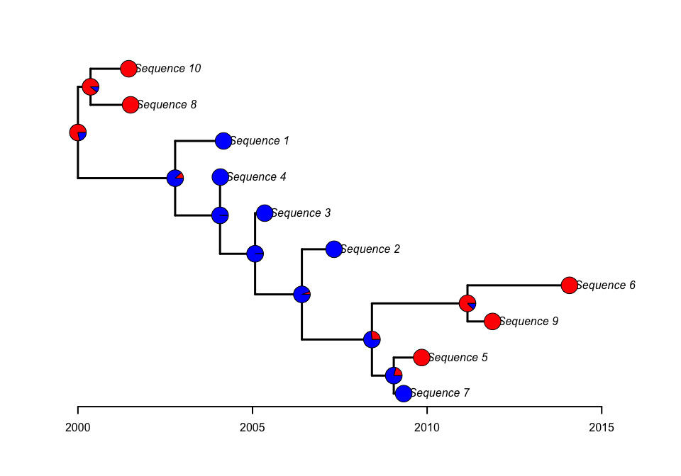
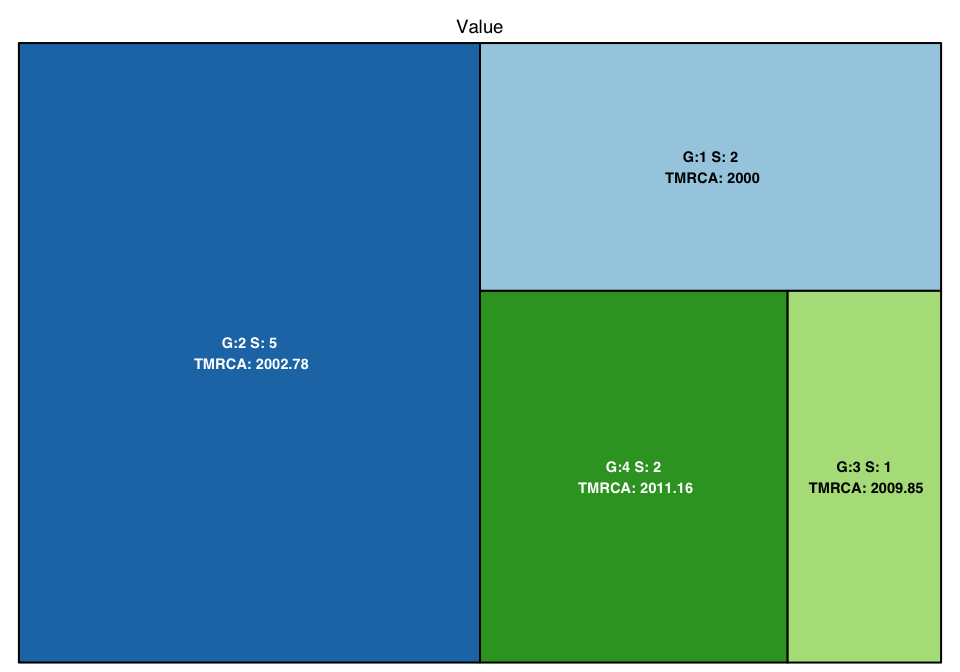

<!-- README.md is generated from README.Rmd. Please edit that file -->

# LineageHomology

-   [Installation](#installation)
-   [Introduction](#introduction)
-   [Tutorial and gallery of plotting methods](#tutorial)

<!-- badges: start -->
<!-- badges: end -->

LineageHomology provides a set of functions that analyzes the outputs
from ancestral state reconstructions. LineageHomology counts
transmission lineages according to state transitions between ancestral
and descendant nodes that have a probability higher than 50 percent. The
method is analogous to that introduced by du Plessis et al. (2021) (DOI:
10.1126/science.abf2946). The outputs contain descriptions of
transmission lineages, tips where traits are inferred to be locally
inherited (homologous traits or local transmissions depending on the
context), and other useful summaries.

## Installation

You can install the latest version of LineageHomology from this
repository using

``` r
library(devtools)
devtools::install_github("magnusnosnes/LineageHomology")
```

## Introduction

This introduction provides a simple example of applying ancestral state
reconstruction to simulated geographical data for two locations and
using LineageHomology to analyse the outputs. Here, LineageHomology
provides descriptions of transmission lineages other useful summaries
from the reconstructed states.

First, we simulate data and estimate the ancestral geographical states:

``` r
library(LineageHomology)
#Loading required packages.
library(ape)
#Loading other packages for simulating data. 
library(BactDating)

#Simulate data from Norway and rest of the world
set.seed(400)
tree_test = simdatedtree(nsam=10, dateroot=2000)
tree_test = ape::ladderize(tree_test)
Q=matrix(c(0.5,0.5,0.5,0.5), nrow=2,ncol=2, byrow=F)
colnames(Q)=c("Norway","RoW")
loc = c("Norway", "Norway","Norway","RoW", "RoW", "Norway", "Norway", "RoW", "RoW", "RoW")
names(loc) = tree_test$tip.label

#Reconstruct ancestral states using ace. 
fit1 = ace(x=loc, phy= tree_test, type="discrete", mod="ARD")
plot.phylo(tree_test,edge.width = 2,label.offset = 0.15, mar=c(0.2,0.2,0.2,0.2))
axisPhylo(root.time=2000, backward=F,lwd=2)
nodelabels(pie=fit1$lik.anc,cex=0.7,piecol=c("Red","Blue"))
tips = to.matrix(loc,seq=c("Norway", "RoW"))
tiplabels(pie=tips, cex=0.7,piecol=c("Red","Blue"))
```

 The
tree shows the reconstructed states using the ace function in the ape
package. Each node is coloured according to the probability of the
location. Here red represents Norway, and blue represents the rest of
the world (RoW).

Next we run lineageHomology on the output from ace.

``` r
Return = LineageHomology(tree_test, ace_nodes=fit1$lik.anc,
                        ace_tips = to.matrix(loc, seq=c("Norway", "RoW")), start_time=2000)
Return
#> $Import_LocalTrans
#> [1] 4 6
#> 
#> $Lineage_sizes
#> [1] 3 2 2 3
#> 
#> $Taxa_names
#> $Taxa_names$`Lineage no: 1`
#> [1] "t6" "t7" "t1"
#> 
#> $Taxa_names$`Lineage no: 2`
#> [1] "t3" "t5"
#> 
#> $Taxa_names$`Lineage no: 3`
#> [1] "t4" "t2"
#> 
#> $Taxa_names$`Lineage no: 4`
#> [1] "t10" "t8"  "t9" 
#> 
#> 
#> $`MRCA's`
#> [1] 2000.000 2001.705 2007.369 2001.620
#> 
#> $lineage_state
#> Norway    RoW Norway    RoW 
#>      1      2      1      2 
#> 
#> $Halfedge_over_tmrca
#> [1] 2000.000 2001.242 2004.675 2000.810
```

The results can be visualized by e.g. using a treemap plot.

``` r
LineageHomology::treemap_lineagehomology(Return)
```



The figure shows squares with areas representing the transmission
lineages’ sizes. The text inside the squares gives the estimated time of
the MRCA and the number of tips in the transmission lineages.

## Tutorial

[Tutorial and plotting
methods](https://github.com/magnusnosnes/LineageHomology/blob/master/Examples_and_plotting_methods/Simple_example/Basic_plotting.md)
